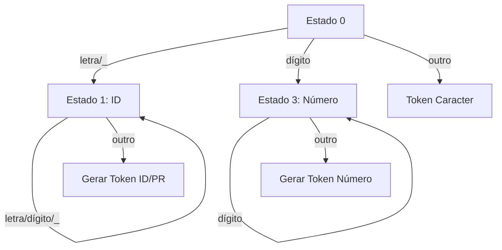

### 1. Fundamentos Teóricos

**Autômato Finito Determinístico (AFD):**
O analisador implementa essencialmente um AFD, onde:
- Os estados representam estágios de reconhecimento (ex: estado 0 = inicial, estado 1 = identificador)
- As transições são acionadas por caracteres de entrada
- Os estados finais correspondem à geração de tokens

**Gramática Regular:**
O analisador reconhece linguagens regulares expressas por:
- Identificadores: `[a-zA-Z_][a-zA-Z0-9_]*`
- Números: `[0-9]+`
- Operadores/pontuação: caracteres simples

### 2. Arquitetura do Código

**Tabela de Símbolos:**
- Estrutura `EntradaTabela` armazena tokens e lexemas
- Funciona como saída do analisador e entrada para o parser
- Implementada como array global para simplicidade

**Máquina de Estados:**
- `estado` controla o fluxo de reconhecimento
- Transições determinísticas baseadas em:
  - `isalpha()`, `isdigit()` para classes de caracteres
  - Caracteres específicos como '_', '\n'

**Buffer de Lexemas:**
- `lexema[MAX_LEXEMA]` acumula caracteres durante o reconhecimento
- Resetado quando um token é completo

### 3. Processo de Análise

1. **Inicialização**:
   - Tabela de símbolos vazia
   - Estado inicial (0)
   - Contadores de linha/coluna resetados

2. **Reconhecimento de Tokens**:


3. **Tratamento Especial**:
   - Palavras reservadas: verificação pós-reconhecimento
   - Controle de posição (linha/coluna)
   - Lookahead implícito com `volta_caractere()`

### 4. Teoria de Linguagens Aplicada

**Linguagem Reconhecida**:
- Conjunto de tokens válidos forma a linguagem regular
- Expressível por expressões regulares:
  - `if|else|while|for|int|float|char|return` (palavras reservadas)
  - `[a-zA-Z_][a-zA-Z0-9_]*` (identificadores)
  - `[0-9]+` (números inteiros)

**Propriedades Formais**:
- Prefixo máximo (greedy matching)
- Prioridade implícita (ordem dos casos no switch)
- Reconhecimento sem retrocesso (determinístico)

### 5. Limitações e Melhorias Potenciais

**Limitações Atuais**:
- Não suporta números decimais/científicos
- Operadores multi-caracter (==, !=)
- Strings/comentários
- Tratamento de erros básico

**Extensões Teóricas**:
1. **Autômatos de Pilha**: Para linguagens livres de contexto
2. **Tabelas de Símbolos Hierárquicas**: Para escopos aninhados
3. **Gerador de Analisadores**: Usando Lex/Yacc

### 6. Complexidade Computacional

**Temporal**: O(n) para:
- n = número de caracteres de entrada
- Cada caractere processado exatamente uma vez
- Operações por caractere: O(1) (acesso a tabela, comparações)

**Espacial**: O(k) para:
- k = tamanho máximo do lexema
- Tabela de símbolos pré-alocada (1000 entradas)

### 7. Casos de Borda Teóricos

1. **Identificadores vs Palavras Reservadas**:
   - Reconhecimento igual inicialmente
   - Desambiguação via tabela pós-reconhecimento

2. **Lookahead**:
   - Necessário para tokens como `>` vs `>=`
   - Implementado via `volta_caractere()`

3. **Final de Arquivo**:
   - Token especial EOF
   - Garante término do parser

### 8. Prática Profissional

Em compiladores reais:
1. **Otimizações**:
   - Tabelas de símbolos com hash
   - Buffering eficiente de entrada
   - Compressão de tokens

2. **Integração**:
   - Parser gerencia tabela de símbolos
   - Tokens incluem metadados (linha/coluna)

3. **Ferramentas**:
   - Lex/Flex para geração automática
   - Análise semântica integrada

Vou explicar linha por linha do código organizado nos três arquivos, destacando o propósito teórico e prático de cada componente:

---

### **1. analisador_lexico.h** (Cabeçalho)

```c
#ifndef ANALISADOR_LEXICO_H
#define ANALISADOR_LEXICO_H
```
- **Teoria**: Diretivas de pré-processador para evitar inclusão múltipla (garante idempotência).
- **Prática**: Se `ANALISADOR_LEXICO_H` não foi definido, define e inclui o conteúdo abaixo.

---

```c
#include <stdio.h>
#include <ctype.h>
#include <stdlib.h>
#include <string.h>
```
- **Teoria**: Bibliotecas padrão para E/S, manipulação de caracteres, alocação de memória e strings.
- **Prática**: 
  - `ctype.h`: Funções como `isalpha()`, `isdigit()` para classificação de caracteres.
  - `string.h`: `strcpy()` para manipulação de lexemas.

---

```c
#define MAX_LEXEMA 100
```
- **Teoria**: Define o tamanho máximo de um lexema (cadeia reconhecida como token).
- **Prática**: Evita estouro de buffer no array `lexema[]`.

---

```c
#define PALAVRA_RESERVADA 1
#define IDENTIFICADOR 2
...
#define FIM_DE_ARQUIVO 9
```
- **Teoria**: Mapeamento de tipos de tokens para números (enumeração implícita).
- **Prática**: Facilita a comparação de tokens no parser.

---

```c
typedef struct {
    int token;
    char lexema[MAX_LEXEMA];
} EntradaTabela;
```
- **Teoria**: Estrutura para representar entradas na tabela de símbolos (símbolo terminal na gramática).
- **Prática**: Armazena o tipo do token e sua representação textual.

---

```c
extern EntradaTabela tabelaSimbolos[1000];
extern int indiceTabela;
...
extern int coluna;
```
- **Teoria**: Declaração de variáveis globais com linkage externo.
- **Prática**: Permite acesso às variáveis em outros arquivos (`main.c`, `analisador_lexico.c`).

---

### **2. analisador_lexico.c** (Implementação)

```c
char ler_caractere() {
    char c = fgetc(arquivo);
    if (c == EOF) return EOF;
    if (c == '\n') { linha++; coluna = 1; }
    else coluna++;
    return c;
}
```
- **Teoria**: Função de leitura de caracteres com rastreamento de posição (linha/coluna).
- **Prática**: 
  - `fgetc()` lê um caractere do arquivo.
  - Atualiza contadores para mensagens de erro.

---

```c
void volta_caractere(char c) {
    if (c == EOF) return;
    ungetc(c, arquivo);
    coluna--;
    if (c == '\n') linha--;
}
```
- **Teoria**: Implementa lookahead (retrocesso de um caractere).
- **Prática**: 
  - `ungetc()` devolve o caractere ao buffer.
  - Ajusta contadores de posição.

---

```c
void gravar_token(int token, const char *lexema) {
    if (indiceTabela < 1000) {
        tabelaSimbolos[indiceTabela].token = token;
        strcpy(tabelaSimbolos[indiceTabela].lexema, lexema);
        indiceTabela++;
    }
}
```
- **Teoria**: Adiciona entrada à tabela de símbolos (geração de tokens).
- **Prática**: 
  - `strcpy()` copia o lexema para a tabela.
  - Verifica limite máximo de tokens.

---

```c
int e_palavra_reservada(const char *lexema) {
    const char *palavras_reservadas[] = {"if", "else", ..., NULL};
    for (int i = 0; palavras_reservadas[i] != NULL; i++) {
        if (strcmp(lexema, palavras_reservadas[i]) == 0) return 1;
    }
    return 0;
}
```
- **Teoria**: Reconhecer palavras reservadas (símbolos terminais fixos).
- **Prática**: Comparação com lista pré-definida usando `strcmp()`.

---

```c
int analex() {
    char c, lexema[MAX_LEXEMA];
    int pos = 0, estado = 0;
    while (1) {
        c = ler_caractere();
        ...
```
- **Teoria**: Implementação do autômato finito determinístico (AFD).
- **Prática**: 
  - `lexema[]` acumula caracteres durante o reconhecimento.
  - `estado` controla a transição entre estados do AFD.

---

### **3. main.c** (Ponto de Entrada)

```c
EntradaTabela tabelaSimbolos[1000];
int indiceTabela = 0;
...
int coluna = 1;
```
- **Teoria**: Definição (alocação) de variáveis globais declaradas como `extern` no header.
- **Prática**: Inicialização da tabela de símbolos e variáveis de estado.

---

```c
arquivo = fopen(argv[1], "r");
if (arquivo == NULL) { ... }
```
- **Teoria**: Abertura do arquivo de entrada (fonte a ser compilado).
- **Prática**: Verificação de erros de E/S.

---

```c
while (analex() != FIM_DE_ARQUIVO) {}
```
- **Teoria**: Loop principal de análise léxica (chamada recursiva ao analisador).
- **Prática**: Processa todos os tokens até EOF.

---

### **4. Makefile** (Compilação)

```makefile
%.o: %.c analisador_lexico.h
    $(CC) $(CFLAGS) -c $<
```
- **Teoria**: Regra implícita para compilar arquivos `.c` em `.o`.
- **Prática**: 
  - `-c`: Compila sem linkeditar.
  - `$<`: Variável automática para o primeiro pré-requisito (arquivo `.c`).

---

### **Exemplo de Fluxo de Execução**

Para o código-fonte `if x == 42`:

1. `main.c` abre o arquivo e chama `analex()`.
2. `analex()`:
   - Lê 'i' → 'f' → espaço (estado 1).
   - Gera token `PALAVRA_RESERVADA` para "if".
3. Repete para:
   - `IDENTIFICADOR` ("x").
   - `OPERADOR_RELACIONAL` ("==").
   - `NUMERO_INTEIRO` ("42").

---

### **Diagrama de Estados do AFD**


Cada linha do código contribui para esse modelo teórico, implementando:
- Transições entre estados.
- Ações semânticas (gravar tokens).
- Controle do fluxo de caracteres.


Claro! Vou explicar cada parte do código do analisador léxico em C.

---

## **1. Inclusão de bibliotecas e definição de constantes**
```c
#include <stdio.h>
#include <ctype.h>
#include <stdlib.h>
#include <string.h>
```
Essas bibliotecas são essenciais para o funcionamento do analisador léxico:
- `stdio.h` → Entrada e saída padrão (`printf`, `fgetc`, `fopen`, etc.).
- `ctype.h` → Funções para verificar tipos de caracteres (`isalpha`, `isdigit`, `isspace`).
- `stdlib.h` → Funções utilitárias (`exit`, alocação de memória, etc.).
- `string.h` → Manipulação de strings (`strcpy`, `strcmp`).

```c
#define MAX_LEXEMA 100
```
Define um tamanho máximo de 100 caracteres para os lexemas identificados.

---

## **2. Definição dos tokens**
```c
#define PALAVRA_RESERVADA 1
#define IDENTIFICADOR 2
#define NUMERO_INTEIRO 3
#define OPERADOR_RELACIONAL 5
#define CARACTER_ESPECIAL 6
#define PONTUACAO 7
#define OPERADOR_ARITMETICO 8
#define FIM_DE_ARQUIVO 9
```
Os tokens representam categorias de lexemas reconhecidos. Cada tipo de elemento léxico recebe um número correspondente.

---

## **3. Estrutura para armazenar tokens**
```c
typedef struct {
    int token;
    char lexema[MAX_LEXEMA];
} EntradaTabela;
```
Essa `struct` define uma entrada da tabela de símbolos, onde:
- `token` → Código do tipo do lexema (ex.: `PALAVRA_RESERVADA`, `IDENTIFICADOR`).
- `lexema` → A string correspondente ao token identificado.

---

## **4. Declaração de variáveis globais**
```c
extern EntradaTabela tabelaSimbolos[1000];
extern int indiceTabela;
extern FILE *arquivo;
extern int linha;
extern int coluna;
```
- `tabelaSimbolos[1000]` → Armazena até 1000 tokens identificados.
- `indiceTabela` → Índice atual da tabela de símbolos.
- `arquivo` → Ponteiro para o arquivo de entrada.
- `linha` e `coluna` → Controlam a posição no arquivo (usado para depuração e mensagens de erro).

---

## **5. Protótipos das funções**
```c
char ler_caractere();
void volta_caractere(char c);
void gravar_token(int token, const char *lexema);
int analex();
int e_palavra_reservada(const char *lexema);
void imprimir_tabela_simbolos();
```
Declaração das funções que serão implementadas.

---

## **6. Implementação das funções**
### **6.1. Ler um caractere do arquivo**
```c
char ler_caractere() {
    char c = fgetc(arquivo);
    if (c == EOF) {
        return EOF;
    }
    if (c == '\n') {
        linha++;
        coluna = 1;
    } else {
        coluna++;
    }
    return c;
}
```
- Usa `fgetc` para ler um caractere do arquivo.
- Se for `EOF`, retorna `EOF` para indicar fim de arquivo.
- Se for `\n`, incrementa `linha` e reseta `coluna`.
- Caso contrário, apenas incrementa `coluna`.

---

### **6.2. Voltar um caractere no arquivo**
```c
void volta_caractere(char c) {
    if (c == EOF) return;
    ungetc(c, arquivo);
    coluna--;
    if (c == '\n') {
        linha--;
    }
}
```
- Se o caractere não for `EOF`, coloca-o de volta no fluxo de entrada (`ungetc`).
- Atualiza `coluna` e `linha` para manter a posição correta no arquivo.

---

### **6.3. Gravar um token na tabela de símbolos**
```c
void gravar_token(int token, const char *lexema) {
    if (indiceTabela < 1000) {
        tabelaSimbolos[indiceTabela].token = token;
        strcpy(tabelaSimbolos[indiceTabela].lexema, lexema);
        indiceTabela++;
    }
}
```
- Adiciona um token na `tabelaSimbolos` se houver espaço disponível (`< 1000`).
- Usa `strcpy` para copiar o lexema.

---

### **6.4. Verificar se uma string é uma palavra reservada**
```c
int e_palavra_reservada(const char *lexema) {
    const char *palavras_reservadas[] = {
        "if", "else", "while", "for", "int", "float", "char", "return", NULL
    };

    for (int i = 0; palavras_reservadas[i] != NULL; i++) {
        if (strcmp(lexema, palavras_reservadas[i]) == 0) {
            return 1;
        }
    }
    return 0;
}
```
- Verifica se `lexema` está na lista de palavras reservadas (`if`, `else`, `while`, etc.).
- Retorna `1` se for palavra reservada, `0` caso contrário.

---

### **6.5. Imprimir tabela de símbolos**
```c
void imprimir_tabela_simbolos() {
    printf("Tabela de Símbolos:\n");
    printf("Token\t\tLexema\n");
    printf("----------------------------\n");
    for (int i = 0; i < indiceTabela; i++) {
        printf("%d\t\t%s\n", tabelaSimbolos[i].token, tabelaSimbolos[i].lexema);
    }
}
```
- Exibe todos os tokens e lexemas armazenados.

---

## **7. Implementação do analisador léxico**
```c
int analex() {
    char c, lexema[MAX_LEXEMA];
    int pos = 0;
    int estado = 0;

    while (1) {
        c = ler_caractere();

        if (c == EOF) {
            gravar_token(FIM_DE_ARQUIVO, "EOF");
            return FIM_DE_ARQUIVO;
        }

        switch (estado) {
            case 0:
                if (isalpha(c) || c == '_') {
                    lexema[pos++] = c;
                    estado = 1;
                } else if (isdigit(c)) {
                    lexema[pos++] = c;
                    estado = 3;
                } else if (isspace(c)) {
                    // Ignora espaços
                } else {
                    lexema[pos++] = c;
                    lexema[pos] = '\0';
                    gravar_token(CARACTER_ESPECIAL, lexema);
                    pos = 0;
                    return CARACTER_ESPECIAL;
                }
                break;

            case 1:
                if (isalnum(c) || c == '_') {
                    lexema[pos++] = c;
                } else {
                    volta_caractere(c);
                    lexema[pos] = '\0';
                    pos = 0;

                    if (e_palavra_reservada(lexema)) {
                        gravar_token(PALAVRA_RESERVADA, lexema);
                        return PALAVRA_RESERVADA;
                    } else {
                        gravar_token(IDENTIFICADOR, lexema);
                        return IDENTIFICADOR;
                    }
                }
                break;

            case 3:
                if (isdigit(c)) {
                    lexema[pos++] = c;
                } else {
                    volta_caractere(c);
                    lexema[pos] = '\0';
                    pos = 0;
                    gravar_token(NUMERO_INTEIRO, lexema);
                    return NUMERO_INTEIRO;
                }
                break;
        }
    }
}
```
Esse é o coração do analisador léxico, que reconhece:
- Identificadores e palavras reservadas.
- Números inteiros.
- Caracteres especiais.

---

## **8. Função `main`**
```c
int main(int argc, char *argv[]) {
    if (argc < 2) {
        printf("Uso: %s <arquivo_de_entrada>\n", argv[0]);
        return 1;
    }

    arquivo = fopen(argv[1], "r");
    if (arquivo == NULL) {
        printf("Erro ao abrir o arquivo %s\n", argv[1]);
        return 1;
    }

    while (analex() != FIM_DE_ARQUIVO) {}

    fclose(arquivo);
    imprimir_tabela_simbolos();

    return 0;
}
```
- Abre um arquivo passado como argumento.
- Executa `analex()` até chegar no fim do arquivo.
- Fecha o arquivo e imprime a tabela de símbolos.
